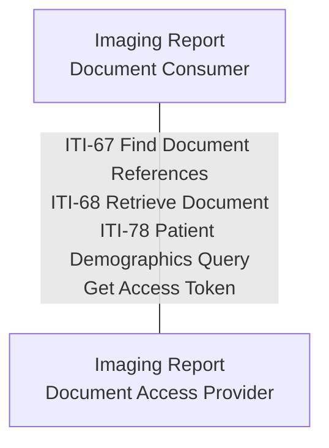

### Actor Grouping

This composite actor groups the following IHE actors:
- [IUA Authorization Server](https://profiles.ihe.net/ITI/IUA/index.html#34112-authorization-server)
- [IUA Resource Server](https://profiles.ihe.net/ITI/IUA/index.html#34113-resource-server)
- [PDQm Patient Demographics Supplier](https://profiles.ihe.net/ITI/PDQm/volume-1.html)
- [MHD Document Responder](https://profiles.ihe.net/ITI/MHD/1331_actors_and_transactions.html)

### Transactions

| Transaction | Description | Optionality |
|-------------|-------------|-------------|
| ITI-67 Find Document References | Respond to document metadata queries from Document Consumers | R |
| ITI-68 Retrieve Document | Serve document content to Document Consumers | R |
| ITI-78 Patient Demographics Query | Respond to patient demographics queries | R |
| Get Access Token | Issue authorization tokens to clients | R |

### Security
Systems SHALL support SMART Backend Services authorization for all transactions.

### Document Submission Option
To accept document publication from external Document Publishers, implement the
[Document Submission Option](https://build.fhir.org/ig/euridice-org/jwg-api/branches/API-ig-draft/en/CapabilityStatement-EEHRxF-DocumentAccessProvider-SubmissionOption.html).

### Deployment
The Document Access Provider may be grouped with Document Publisher, in which case
document publication is internal. See the
[grouped Document Publisher/Access Provider CapabilityStatement](https://build.fhir.org/ig/euridice-org/jwg-api/branches/API-ig-draft/en/CapabilityStatement-EEHRxF-DocumentPublisherAccessProvider.html)
for this deployment pattern.