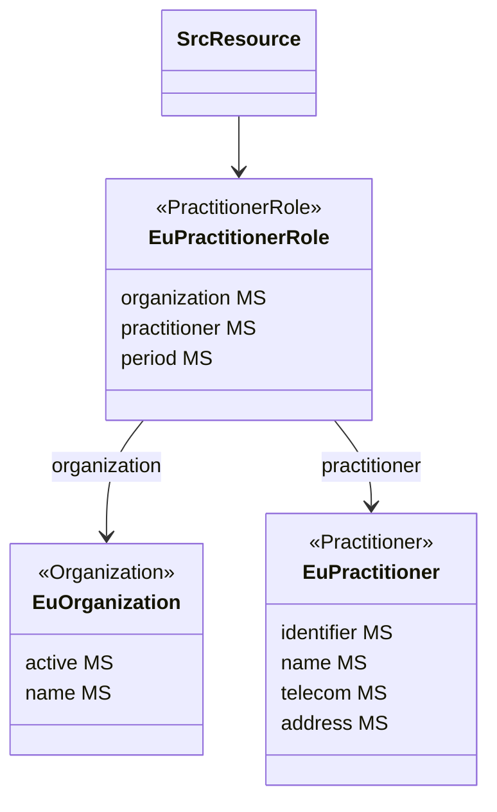

### Representing Healthcare Professionals

When referring to healthcare professionals, the {{ehnImagingGuidelines}} include information on the professional as well as on the organization the professional is associated with (e.g. information recipient, author, resultValidator, etc.). In FHIR a healthcare professional is represented as a `Practitioner`. As a healthcare professional can be employed by multiple organizations, a different resource,`PractitionerRole` models the relationship between the healthcare professional and an organization.
For the representation of healthcare professionals, organizations and the relations between them, this implementation guide uses the profiles defined by {{hl7EuBase}}:

