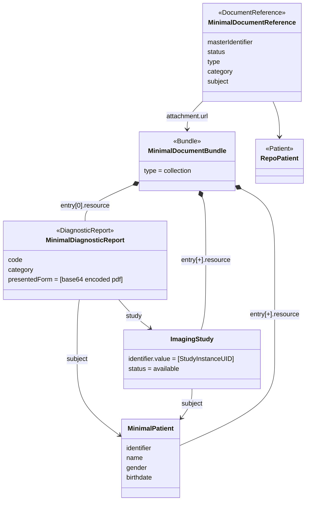

Imaging reports exists in many different forms. Especially for older reports, there is little or no structured data available and the content is expressed as text or pdf's. More recent reports will use CDA and might be provided using the IHE-RAD ORU <link> format, providing more structured data

There is a large amount of older reports that are expressed in text or pdf format. Current reports are often represented as CDA documents. It is expected that newer reports will use the format defined in this specification.

### Minimal Structured Reports

These reports represent the reports for which minimal information is known. The minimal structured data for an imaging report consists of:
* patient reference
* the StudyInstanceUID of the study reported on.

Typically, these reports are expressed in `pdf`. The figure below illustrates the representation of the report in this report.

The report is represented as a FHIR collection `Bundle` containing a `DiagnosticReport`, `Patient` and `ImagingStudy` report. The `DiagnosticReport` contains the pdf as a `presentedForm`.

When stored in a FHIR repo, the Bundle is stored as a whole and a `MinimalDocumentReference` resource is present providing the metadata for this report. The attachment points to the Bundle.

### Full reports

This class of reports represents reports expressed in this format. The source of this reports contains reports created directly in this report and report currently expressed as CDA document.

Reports expressed as CDA documents are expected to be transcoded in this format and SHALL not be represented in the minimal format.