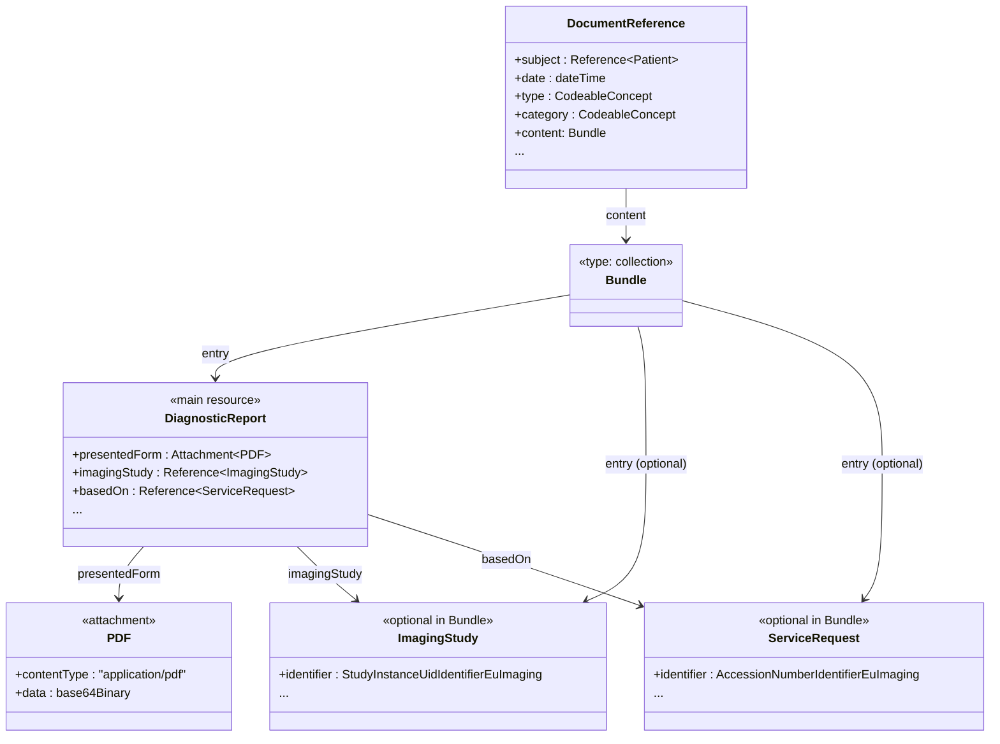
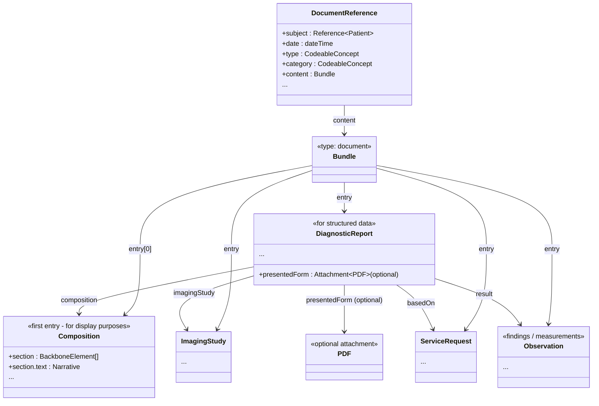

# Use Cases
This page explains the use cases that are supported by the specification. It also describes the actors involved in these use cases and their obligations.
There are a number of angles to look at the use cases. One is based on the different user/system actors involved and their obligations. Another is based on the different data formats that are supported. Also, the way how this specification is connected with the IHE MADE profile, and with the EHDS API specification are explained from a functional perspective.

## Use Cases based on Actors and Obligations
A number of actors and use cases have been identified as a minimal set of functionalities that are needed to support the use of the EHDS Imaging Report specification. These use cases are described in the following figure.
<figure>
  
  <figcaption>Figure: EHDS Imaging Report Functional Use Cases</figcaption>
</figure>
 

## Use cases based on Data Formats
The EHDS Imaging Report specification supports the use of different data formats for the representation of imaging reports, that introduce increasing level of structure to the data exchanged. 

### Renderable format with basic metadata
Comprised of a `Bundle` of type collection containging a `DiagnosticReport` with a reference to a PDF (or other renderable format) attachment through .presentedForm, the `ImagingStudy` resource/s that is the object of the report, and the `ServiceRequest` that representd the original order for the study, and the `Patient` to whom the report belong. Other resources are also allowed, to encode other elements of the report environment, as specified by this IG. A `DocumentReference` resource wrapper pointing to the `Bundle` is be used to encode the  elements uses as search parameters to fullfil functional requirments of the ACCESS actor.
Note that no `Composition` resource is used in this case, and the `DiagnosticReport` is used as the main resource to represent the report.
This level of structure allows to have a human readable report (the PDF) that can fullfill the requirements of the DISPLAY actor, while also having some basic metadata about the report and its connection with the imaging study and service request. 

### Section-strucured report with processable narrative
Building on top of the previous data format, the `DiagnosticReport` is exchanged alongside with a `Composition` as entries of a `Bundle` of type `document`. Both `DiagnosticReport` and `Composition` encode the same information, but the `Composition` can be used for display purposes, especially the narrative sections of the report, while the `DiagnosticReport` can be used for the interpretation of the structured data.  The `DocumentReference` resource wrapper, as in the previous case, as interface layer to surface search paramenters that allow finding and retrieving the report.
In this case the .pdf looses relevance, as the narrative of the `Composition` can adapt dinamycally to different display contexts. However, the .pdf can still be included as an attachment in the `DiagnosticReport` for archival purposes, or for use cases where a human readable report is needed without the need for structured data. Creators of this type of report must ensure a tight consistency between the narrative of the `Composition` and the .pdf, as they are both intended for display purposes. 
This data structure is the one that should be utilizaed to map the existing implementations that utilizes HL2 V2 messages or DICOM SR containing a CDA or other .xml or .html file as the report content.
This level of structure allows to have a PROCESSOR actor that can interpret the structured data and the narrative (as it is exchagned in a machine readable format).

### Fully structured report
This case builds on top of the previous one, but in this case the findings and impressions of the report are coded (ideally a standard clinical or radiology domain terminology) and encoded in FHIR `Observation` and `Condition` resources. This allows to have a fully computable report that can be easily integrated with other data sources, and that can be used for advanced use cases such as clinical decision support, research, etc. The `Composition` resource is still used for display purposes, but the narrative of the sections can be generated dynamically based on the coded data, and the .pdf looses relevance in this case.
It is expected that most systems will not be able to produce this level of structure in the short term, but it is important to have it as a long term goal, as it allows to fully leverage the potential of the FHIR format for imaging reports.

## Alignment between IHE IDR and EHDS Imaging Report IG
