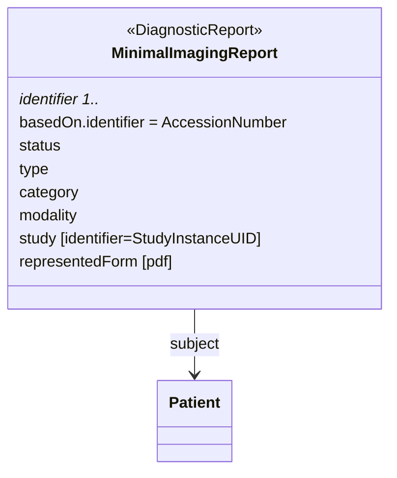

Many of the current imaging reports are expressed as pdf documents. Even in the situation where all future reports are represented by a fully structured FHIR based report, there is a large volume of existing reports that need to be represented in the EHDS infrastructure.

Only limited information of the context and content of the report is known. The minimal information required to label an imaging report is:

* The subject of the report.
* The AccessionNumber of the order.
* The study instance UID of the study that let to the report (CHECK not always known in EHRs).

The figure below illustrates the structure of such document.

When more information is known it can be added. These categories are not atomic but a scale where this is the minimal one.