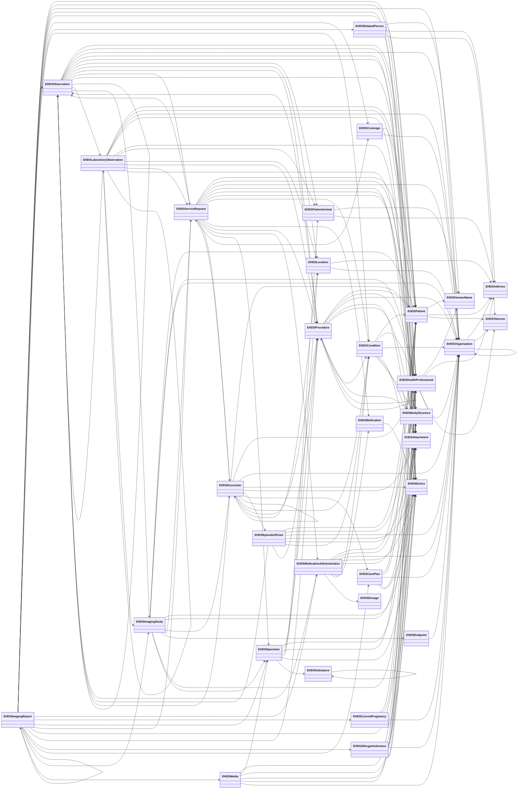

```mermaid
classDiagram
direction LR
EHDSImagingReport --> EHDSPatient 
EHDSImagingReport --> EHDSHealthProfessional 
EHDSImagingReport --> EHDSOrganisation 
EHDSImagingReport --> EHDSDevice 
EHDSImagingReport --> EHDSAttachment 
EHDSImagingReport --> EHDSCoverage 
EHDSImagingReport --> EHDSRelatedPerson 
EHDSImagingReport --> EHDSCondition 
EHDSImagingReport --> EHDSObservation 
EHDSImagingReport --> EHDSMedicationAdministration 
EHDSImagingReport --> EHDSCurrentPregnancy 
EHDSImagingReport --> EHDSSpecimen 
EHDSImagingReport --> EHDSServiceRequest 
EHDSImagingReport --> EHDSBodyStructure 
EHDSImagingReport --> EHDSProcedure 
EHDSImagingReport --> EHDSAllergyIntolerance 
EHDSImagingReport --> EHDSCarePlan 
EHDSImagingReport --> EHDSImagingReport 
EHDSImagingReport --> EHDSImagingStudy 
EHDSImagingReport --> EHDSMedia 
EHDSPatient --> EHDSHumanName 
EHDSPatient --> EHDSAddress 
EHDSPatient --> EHDSTelecom 
EHDSHealthProfessional --> EHDSHumanName 
EHDSHealthProfessional --> EHDSAddress 
EHDSHealthProfessional --> EHDSTelecom 
EHDSHealthProfessional --> EHDSOrganisation 
EHDSOrganisation --> EHDSAddress 
EHDSOrganisation --> EHDSTelecom 
EHDSOrganisation --> EHDSOrganisation 
EHDSCoverage --> EHDSPatient 
EHDSCoverage --> EHDSOrganisation 
EHDSRelatedPerson --> EHDSHumanName 
EHDSRelatedPerson --> EHDSPatient 
EHDSRelatedPerson --> EHDSAddress 
EHDSRelatedPerson --> EHDSTelecom 
EHDSCondition --> EHDSPatient 
EHDSCondition --> EHDSHealthProfessional 
EHDSCondition --> EHDSOrganisation 
EHDSCondition --> EHDSDevice 
EHDSCondition --> EHDSAttachment 
EHDSCondition --> EHDSBodyStructure 
EHDSObservation --> EHDSPatient 
EHDSObservation --> EHDSHealthProfessional 
EHDSObservation --> EHDSOrganisation 
EHDSObservation --> EHDSDevice 
EHDSObservation --> EHDSAttachment 
EHDSObservation --> EHDSPatientAnimal 
EHDSObservation --> EHDSLocation 
EHDSObservation --> EHDSProcedure 
EHDSObservation --> EHDSServiceRequest 
EHDSObservation --> EHDSBodyStructure 
EHDSObservation --> EHDSObservation 
EHDSObservation --> EHDSLaboratoryObservation 
EHDSObservation --> EHDSImagingStudy 
EHDSPatientAnimal --> EHDSHumanName 
EHDSPatientAnimal --> EHDSAddress 
EHDSLocation --> EHDSAddress 
EHDSLocation --> EHDSOrganisation 
EHDSProcedure --> EHDSPatient 
EHDSProcedure --> EHDSHealthProfessional 
EHDSProcedure --> EHDSOrganisation 
EHDSProcedure --> EHDSDevice 
EHDSProcedure --> EHDSAttachment 
EHDSProcedure --> EHDSBodyStructure 
EHDSProcedure --> EHDSCondition 
EHDSProcedure --> EHDSObservation 
EHDSProcedure --> EHDSProcedure 
EHDSServiceRequest --> EHDSPatient 
EHDSServiceRequest --> EHDSHealthProfessional 
EHDSServiceRequest --> EHDSOrganisation 
EHDSServiceRequest --> EHDSDevice 
EHDSServiceRequest --> EHDSAttachment 
EHDSServiceRequest --> EHDSBodyStructure 
EHDSServiceRequest --> EHDSObservation 
EHDSServiceRequest --> EHDSCondition 
EHDSServiceRequest --> EHDSMedication 
EHDSServiceRequest --> EHDSProcedure 
EHDSServiceRequest --> EHDSMedicationAdministration 
EHDSServiceRequest --> EHDSSpecimen 
EHDSServiceRequest --> EHDSEncounter 
EHDSServiceRequest --> EHDSCoverage 
EHDSMedication --> EHDSDevice 
EHDSMedicationAdministration --> EHDSPatient 
EHDSMedicationAdministration --> EHDSHealthProfessional 
EHDSMedicationAdministration --> EHDSOrganisation 
EHDSMedicationAdministration --> EHDSDevice 
EHDSMedicationAdministration --> EHDSAttachment 
EHDSMedicationAdministration --> EHDSMedication 
EHDSMedicationAdministration --> EHDSCondition 
EHDSMedicationAdministration --> EHDSObservation 
EHDSMedicationAdministration --> EHDSDosage 
EHDSSpecimen --> EHDSBodyStructure 
EHDSSpecimen --> EHDSProcedure 
EHDSSpecimen --> EHDSPatient 
EHDSSpecimen --> EHDSPatientAnimal 
EHDSSpecimen --> EHDSLocation 
EHDSSpecimen --> EHDSDevice 
EHDSSpecimen --> EHDSSubstance 
EHDSSubstance --> EHDSSubstance 
EHDSEncounter --> EHDSPatient 
EHDSEncounter --> EHDSHealthProfessional 
EHDSEncounter --> EHDSOrganisation 
EHDSEncounter --> EHDSDevice 
EHDSEncounter --> EHDSAttachment 
EHDSEncounter --> EHDSEpisodeOfCare 
EHDSEncounter --> EHDSCarePlan 
EHDSEncounter --> EHDSServiceRequest 
EHDSEncounter --> EHDSEncounter 
EHDSEncounter --> EHDSCondition 
EHDSEncounter --> EHDSProcedure 
EHDSEncounter --> EHDSObservation 
EHDSEncounter --> EHDSLocation 
EHDSEpisodeOfCare --> EHDSPatient 
EHDSEpisodeOfCare --> EHDSHealthProfessional 
EHDSEpisodeOfCare --> EHDSOrganisation 
EHDSEpisodeOfCare --> EHDSDevice 
EHDSEpisodeOfCare --> EHDSAttachment 
EHDSEpisodeOfCare --> EHDSCondition 
EHDSEpisodeOfCare --> EHDSProcedure 
EHDSEpisodeOfCare --> EHDSObservation 
EHDSCarePlan --> EHDSPatient 
EHDSCarePlan --> EHDSHealthProfessional 
EHDSCarePlan --> EHDSOrganisation 
EHDSCarePlan --> EHDSDevice 
EHDSCarePlan --> EHDSAttachment 
EHDSLaboratoryObservation --> EHDSPatient 
EHDSLaboratoryObservation --> EHDSHealthProfessional 
EHDSLaboratoryObservation --> EHDSOrganisation 
EHDSLaboratoryObservation --> EHDSDevice 
EHDSLaboratoryObservation --> EHDSAttachment 
EHDSLaboratoryObservation --> EHDSPatientAnimal 
EHDSLaboratoryObservation --> EHDSLocation 
EHDSLaboratoryObservation --> EHDSProcedure 
EHDSLaboratoryObservation --> EHDSServiceRequest 
EHDSLaboratoryObservation --> EHDSBodyStructure 
EHDSLaboratoryObservation --> EHDSObservation 
EHDSLaboratoryObservation --> EHDSLaboratoryObservation 
EHDSLaboratoryObservation --> EHDSImagingStudy 
EHDSImagingStudy --> EHDSPatient 
EHDSImagingStudy --> EHDSHealthProfessional 
EHDSImagingStudy --> EHDSOrganisation 
EHDSImagingStudy --> EHDSDevice 
EHDSImagingStudy --> EHDSAttachment 
EHDSImagingStudy --> EHDSEncounter 
EHDSImagingStudy --> EHDSServiceRequest 
EHDSImagingStudy --> EHDSEndpoint 
EHDSImagingStudy --> EHDSBodyStructure 
EHDSImagingStudy --> EHDSSpecimen 
EHDSEndpoint --> EHDSOrganisation 
EHDSCurrentPregnancy --> EHDSPatient 
EHDSCurrentPregnancy --> EHDSHealthProfessional 
EHDSCurrentPregnancy --> EHDSOrganisation 
EHDSCurrentPregnancy --> EHDSDevice 
EHDSCurrentPregnancy --> EHDSAttachment 
EHDSAllergyIntolerance --> EHDSPatient 
EHDSAllergyIntolerance --> EHDSHealthProfessional 
EHDSAllergyIntolerance --> EHDSOrganisation 
EHDSAllergyIntolerance --> EHDSDevice 
EHDSAllergyIntolerance --> EHDSAttachment 
EHDSMedia --> EHDSPatient 
EHDSMedia --> EHDSSpecimen 
EHDSMedia --> EHDSDevice 
EHDSMedia --> EHDSAttachment 
EHDSMedia --> EHDSHealthProfessional 
EHDSMedia --> EHDSOrganisation 
```
