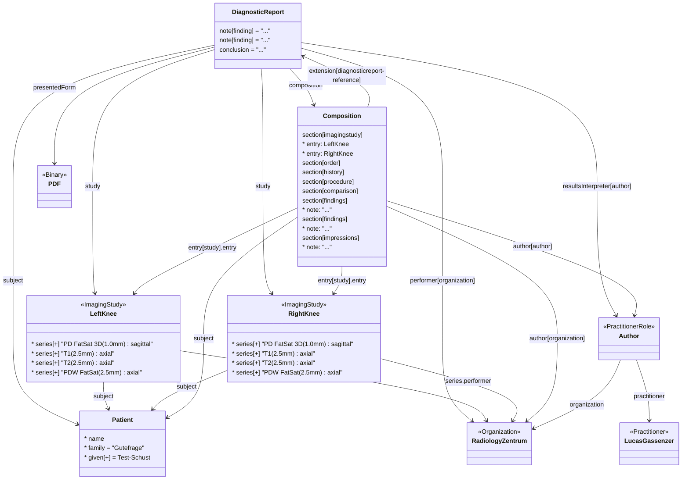



### Semi-structured report

This example addresses representing a imaging report that in the report structure with a mix of structured and unstructured data.

The figure below shows the pdf of the report.



The image shows what part of the report link to different elements in the report structure as defined in this specification. The structure of a imaging report as defined in this specification is illustrated in the figure below.

<!--  -->

